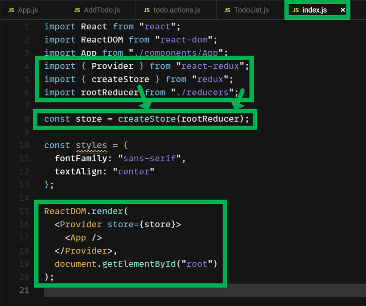
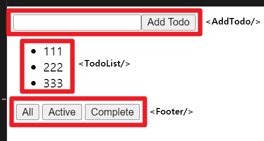

## react-redux Todo App (1)

> 참고 : plain redux 가 아닌 react-redux 에 대해 개념을 정리합니다.

공식 문서에서 제공하는 todo app 예제를 통해 개념을 정리해봅니다.<br/>

현재 버전의 공식 문서에서는 비교적 복잡한 버전의 Todo App 을 사용하는데, 복잡한 버전에 대해서는 추후 다뤄보기로 하고, 이번 문서에서는 다소 간단한 버전의 Todo App 을 통해 redux 의 개념을 살펴봅니다.<br/>

예제의 링크는 [codesandbox](https://codesandbox.io/s/0vm2w0k9r0) 에 있습니다.<br/>


## 참고자료

> [Tutorial : Connect API](https://react-redux.js.org/tutorials/connect)

<br/>


**Jump to**

- 🤞 [Just show me the code](https://codesandbox.io/s/9on71rvnyo) 
- 👆 [Providing the store](https://react-redux.js.org/tutorials/connect#providing-the-store)
- ✌️ [Connecting the Component](https://react-redux.js.org/tutorials/connect#connecting-the-components)

<br/>


**API Reference**

- [connect()](https://react-redux.js.org/api/connect)

<br/>


## Redux


> 출처 : [https://medium.com/globant/react-state-management-b0c81e0cbbf3](https://medium.com/globant/react-state-management-b0c81e0cbbf3)

<br/>


## index.js - store 세팅 (App, Provider, store, rootReducer)

App 컴포넌트는 Provider 객체로 감싸서 ReacDom.render 를 통해 최상단에서 렌더링될 수 있도록 설정하고 있습니다.

```jsx
import React from "react";
import ReactDOM from "react-dom";
import App from "./components/App";
import { Provider } from "react-redux";
import { createStore } from "redux";
import rootReducer from "./reducers"; // (1)

const store = createStore(rootReducer); // (2)

const styles = {
  fontFamily: "sans-serif",
  textAlign: "center"
};

ReactDOM.render(
  // (3)
  <Provider store={store}>
    <App />
  </Provider>,
  document.getElementById("root")
);
```


(1) : rootReducer

- reducers/index.js 파일에서 combineReducer() 로 생성해서 export 한 Object 타입의 객체를 rootReducer 라는 이름으로 import 해서 얻어옵니다.


(2) : store

- Redux 의 createStore(rootReducer)로 얻어낸 store 객체를 생성합니다.


(3) : Provider

- Provider 의 store props 에 store 객체를 바인딩해줍니다.
- Provider 로 App 컴포넌트를 감싸서 store 를 전역으로 사용할 수 있도록 해줍니다.




<br/>


## src/reducers/index.js - rootReducer

src/reducers/index.js 내의 rootReducer 를 선언하는 코드는 아래와 같습니다.<br/>

**src/reducers/index.js**

```jsx
import { combineReducers } from "redux";
import todos from "./todo.reducers";
import filterTodo from "./filter.reducers";
// (2)
export default combineReducers({
  // (1)
  todos, 
  filterTodo
});
```

<br/>


(1) 

- todos : src/reducers/todo.reducers.js 에서 불러온 reducer 입니다.
- filterTodo : src/reducers/filter.reducers.js 에서 불러온 reducer 입니다.

(2)

- combineReducers({...}) : 여러 종류의 reducer 들을 합쳐주는 함수입니다. 'redux' 라이브러리에서 제공하는 함수입니다.

<br/>


todo.reducers.js 파일의 코드는 아래와 같습니다. `todos` 라고 하는 이름의 reducer 를 외부로 export 하고 있습니다.<br/>


**src/reducers/todo.reducers.js**

```js
const todos = (state = [], action) => {
  switch (action.type) {
    case "ADD_TODO":
      return [
        ...state,
        {
          id: action.id,
          complete: action.complete,
          text: action.text
        }
      ];
    case "TOGGLE_TODO":
      return state.map(
        todo =>
          todo.id === action.id ? { ...todo, complete: !todo.complete } : todo
      );
    default:
      return state;
  }
};
export default todos;
```

<br/>


filter.reducers.js 파일의 코드는 아래와 같습니다. filterTodo 라고 하는 이르의 reducer 를 외부로 export 하고 있습니다.<br/>

**src/reducers/filter.reducers.js**

```jsx
const filterTodo = (state = "SHOW_ALL", action) => {
  switch (action.type) {
    case "FILTER_TODO":
      return action.filter;
    default:
      return state;
  }
};

export default filterTodo;
```

<br/>


정리해보면, 위에서 살펴봤던 **src/reducers/index.js** 에서는 위와 같은 **src/reducers/todo.reducers.js**, **src/reducers/filter.reducers.js** 을 combineReducer() 함수로 합쳐줍니다.<br/>

```jsx
import { combineReducers } from "redux";
import todos from "./todo.reducers";
import filterTodo from "./filter.reducers";
// (2)
export default combineReducers({
  // (1)
  todos, 
  filterTodo
});
```

<br/>


**src/reducers/index.js** 에서 combineReducers({...}) 으로 생성한 후 export 한 reducer 객체는 **src/index.js** 에서 아래와 같이 import 합니다(1). 그리고 이 reducer를 store 의 인자로 넘겨주어서 store를 생성하며(2), 최종적으로는 Provider 객체에 store 객체를 바인딩하는 것으로 App 객체의 선언을 마무리(3)합니다. **src/index.js**의 전체 코드는 이전 섹션에서 살펴보았습니다.<br/>


**src/index.js**

```jsx
// ...
import rootReducer from "./reducers"; // (1)
import { createStore } from "redux";

// ...
const store = createStore(rootReducer); // (2)

// ...
ReactDOM.render(
  // (3)
  <Provider store={store}>
    <App />
  </Provider>,
  document.getElementById("root")
);
```

<br/>


react-redux 가 아닌 일반 redux 만 먼저 공부해봤던 분들이라면, 공유해드린 코드의 링크인 [codesandbox](https://codesandbox.io/s/0vm2w0k9r0) 을 참고해보시면, store 를 선언하는 부분이 없다는 점에 대해 의문이 드실 수 있습니다. react-redux 에서는 store 를 직접 선언하지 않고 reducer 를 createStore() 함수 내에 연결해주는 것으로 store 내부에서 관리할 state 들을 지정해줄 수 있습니다.<br/>


> 정리 필요 : reducer 와 store 내에 적용되는 state 의 네이밍 컨벤션

<br/>


## src/actions/todo.actions.js - 액션 정의


> 출처 : [https://medium.com/globant/react-state-management-b0c81e0cbbf3](https://medium.com/globant/react-state-management-b0c81e0cbbf3)

UI 에서 이벤트가 발생하면, UI 는 Action 에 정의한 함수를 dispatch 함수 내에 전달해서 Redux 가 reducer 를 이용해서 store 내의 state 를 처리합니다.<br/>

이번 예제에서 정의한 action 의 정의는 아래와 같습니다.<br/>

**src/actions/todo.actions.js**

```jsx
let nextTodoId = 0;

export const addTodo = text => ({
  type: "ADD_TODO",
  id: nextTodoId++,
  complete: false,
  text
});

export const toggleTodo = id => ({
  type: "TOGGLE_TODO",
  id
});

export const filter = filter => ({
  type: "FILTER_TODO",
  filter
});

export const typeFilter = {
  SHOW_COMPLETE: "SHOW_COMPLETE",
  SHOW_ACTIVE: "SHOW_ACTIVE",
  SHOW_ALL: "SHOW_ALL"
};
```

<br/>


## App.js - 컴포넌트 배치

컴포넌트의 구조는 아래와 같이 구성했습니다.<br/>

**src/components/App.js**

```jsx
import React from "react";
import AddTodo from "../containers/AddTodo";
import TodoList from "../containers/TodoList";
import Footer from "../containers/Footer";

const App = () => (
  <div>
    <AddTodo />
    <TodoList />
    <Footer />
  </div>
);

export default App;
```

<br/>


위 코드에서 배치한 각 컴포넌트는 브라우저 상에서는 아래와 같이 표현됩니다.



<br/>


## src/containers/AddTodo.js - AddTodo 컴포넌트

```jsx
import React from "react";
import { addTodo } from "../actions/todo.actions";
import { connect } from "react-redux";

const AddTodo = ({ dispatch }) => { // (1)
  let input;
  let onClick = (e) => {
    if (input.value.trim() != "") {
      dispatch(addTodo(input.value.trim()));
    }
  };
  return (
    <React.Fragment>
      <input type="text" ref={node => (input = node)} />
      <button type="submit" onClick={onClick}>
        Add Todo
      </button>
    </React.Fragment>
  );
};

export default connect()(AddTodo); // (2)
```

<br/>


(1) : dispatch 객체

- AddTodo 컴포넌트에 props 로 인자를 받고 있는 `dispatch` 함수는 어디서 불러오는지 궁금해질 수 있는데 이 dispatch 함수는 뒤에서 설명할 mapDispatchToProps() 라고 하는 함수를 통해서 전달해줍니다. react-redux 에서는 컴포넌트를 store 에 연결하는 connect() 함수를 제공해주는데 connect() 관련해서는 뒤에서 정리합니다.

(2) : connect()(컴포넌트)

- connect() 는 react-redux 에서 제공하는 함수입니다. 컴포넌트를 store 에 연결해주는 역할을 합니다.
- connect() 함수는 함수를 return 하는데, return 하는 함수의 인자로 컴포넌트를 인자값으로 전달해주는 방식입니다.
- connect() 함수는 인자값들을 아래와 같은 종류들로 받을 수 있습니다.
  - connect()(MyComponent)
  - connect(null, null)(MyComponent)
  - connect(mapStateToProps)(MyComponent)
  - connect(mapStateToProps, mapDispatchToProps)(MyComponent)

<br/>


connect() 함수, mapStateProps, mapDispatchToProps 에 대해서는 뒤에서 간략하게 그림으로 설명합니다.<br/>


## src/containers/TodoList.js - TodoList 컴포넌트

```jsx
import React from "react";
import Todo from "../components/Todo";
import { connect } from "react-redux";
import { toggleTodo } from "../actions/todo.actions";

// (1)
const TodoList = ({ todos, toggleTodo }) => {
  return (
    <ul>
      {todos != null &&
        todos.map(todo => (
              // (4.1)
          <Todo key={todo.id} {...todo} onClick={() => toggleTodo(todo.id)} />
        ))}
    </ul>
  );
};

// (2)
const filterTodos = (todos, filter) => {
  console.log(todos);
  switch (filter) {
    case "SHOW_COMPLETE":
      return todos.filter(todo => todo.complete == true);
    case "SHOW_ACTIVE":
      return todos.filter(todo => todo.complete == false);
    default:
      return todos;
  }
};

// (3)
const mapStateToProps = state => ({
  todos: filterTodos(state.todos, state.filterTodo)
});

// (4)
const mapDispatchToProps = dispatch => ({
  toggleTodo: id => dispatch(toggleTodo(id))
});

// (5)
export default connect(mapStateToProps, mapDispatchToProps)(TodoList);
```

<br/>


(1) : TodoList 컴포넌트

- TodoList 컴포넌트는 todos 라는 객체의 배열, toggleTodo 라고 하는 함수를 props 로 전달받습니다.
- toggleTodo 는 dispatch 함수를 props 로 변환해서 TodoList 컴포넌트로 전달받은 함수입니다.

<br/>


(2) : filterTodos() 함수

- 일반 자바스크립트 함수입니다.
- mapStateToProps() 함수 내부에서 수행하는 코드 들을 간략화 하기위해 따로 함수로 분리해둔 함수입니다.

<br/>


(3) : mapStateToProps = state => ({...})

- mapStateToProps(state) 함수는 인자값으로 전달받은 state 에 대해서 filterTodos() 함수를 이용해서 필터링 작업을 수행하고 이 결과값을 todos 라는 필드에 저장합니다.
- 이 mapStateToProps(state) 함수는 connect() 함수에 인자로 전달됩니다. connect() 함수는 store 에 컴포넌트를 연결 해주는 역할을 하는데, 리덕스는 전달받은 mapStateToProps(state) 함수를 통해 redux 스토어 내부의 state 연산을 수행합니다. 즉, store 내부에서 state 를 접근하는 연산을 하드코딩하지 않고 전달받은 mapStateToProps(state) 함수에 정의된 내용을 수행합니다.
- mapStateToProps(state) 함수로 변환된 state 는 컴포넌트의 props 로 바인딩됩니다.
- state 객체는 사용자가 지정하는 것이 아니라 react-redux 내부에서 지정해줍니다. 우리는 그냥 인자값을 통해서만 접근하면 됩니다.

<br/>


(4) : mapDispatchToProps = dispatch => ({...})

- mapDispatchToProps(dispatch) 함수는 인자값으로 전달받은 dispatch 함수로 action 을 수행합니다. 
- 위의 코드에서는 action 으로 toggleTodo(id) 함수를 지정해줬습니다.
- (4.1) 을 보시면 onClick 이벤트에 대해 togggleTodo(id) 액션을 수행하도록 정의했습니다.
- UI 에서 이벤트가 발생하면 dispatch 내에 사용자가 정의한 action 함수를 전달해서 reducer 에게 전달합니다.


(5) export default connect(mapStateToProps, mapDispatchToProps)(TodoList);

- connect(s,p)(component) 함수로 컴포넌트에 연결합니다.
- connect(s,p)(component) 함수의 결과값을 export 하는 것을 보면 connect(s,p)(connect) 의 return 값은 컴포넌트임을 추론 가능합니다.

<br/>


## src/containers/Footer.js - Footer 컴포넌트

```jsx
import React from "react";
import Link from "../components/Link";

const Footer = () => {
  return (
    <div>
      <Link filter={"SHOW_ALL"}>All</Link>
      <Link filter={"SHOW_ACTIVE"}>Active</Link>
      <Link filter={"SHOW_COMPLETE"}>Complete</Link>
    </div>
  );
};

export default Footer;
```

이 Footer 컴포넌트에서는 Link 라고 하는 컴포넌트를 사용하고 있습니다. Link 컴포넌트에 대해서는 아래에서 자세히 설명합니다.<br/>


## src/components/Link.js - Link 컴포넌트

```jsx
import React from "react";
import PropType from "prop-types";
import { connect } from "react-redux";
import { filter } from "../actions/todo.actions";

// (1)
const Link = ({ active, children, onClick }) => {
  return (
    <button onClick={onClick} disabled={active} style={{ marginLeft: "4px" }}>
      {children}
    </button>
  );
};

// (2)
const mapStateToProps = (state, ownProps) => ({
  active: ownProps.filter === state.visibilityFilter
});

// (3)
const mapDispatchToProps = (dispatch, ownProps) => ({
  onClick: () => {
    console.log("dispatch " + ownProps.filter);
    dispatch(filter(ownProps.filter));
  }
});

// (4)
export default connect(mapStateToProps, mapDispatchToProps)(Link);
```

<br/>


## connect() API


### mapDispatchToProps()

> 원문 출처 : https://react-redux.js.org/using-react-redux/connect-mapdispatch

mapDispatchToProps() 함수는 보통 줄여서 `mapDispatch` 라고 부르지만, 실제 사용되는 변수 이름은 원하는 대로 지정할 수 있습니다.<br/>

#### 1\) bindActionCreators() 를 이용하는 방식

#### 2\) 일반적인 dispatch() 함수 injection


