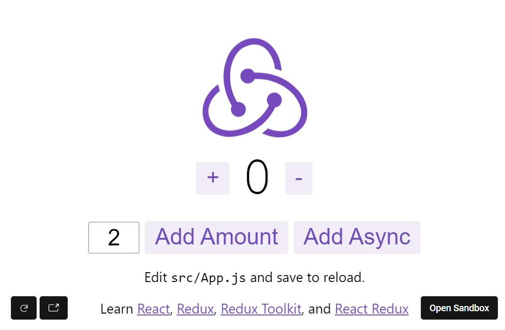

## react-redux hooks - counter app

react-redux 의 hooks API 인 useSelector, useState, useDispatch 와 Redux Toolkit 에서 제공하는 편의성 함수인 configureStore, createStore 및 기타 여러가지 함수들을 사용해서 더 간결한 react-redux 코드를 작성하는 방법에 대해서 알아봅니다. <br/>

저도 공부하면서 정리하는 글이기에 내용이 자주 변경될 수 있다는 점 양해해주시기 바랍니다.<br/>


**configureStore** <br/>

- configureStore() 함수는 redux 의 store 를 생성하는 함수 
- react-redux 에는 createStore() 라는 함수도 있는데, configureStore() 함수는 createStore() 함수에 비해 조금 더 간편하게 store 를 생성할 수 있도록 도와주는 함수
- configureStore() 함수는 react-redux 의 Redux Toolkit 에서 제공하는 함수입니다. 
- 이 configureStore() 함수를 이용하면 미들웨어 설정, Redux DevTools Extension 연결 등의 작업을 자동으로 할 수 있습니다.<br/>


**createSlice**<br/>

- createSlice() 함수는 redux 의 reducer 함수와 action 생성자 함수를 생성하는 함수입니다.
- createSlice() 함수는 반복적인 코드를 줄여줄 수 있도록 react-redux 의 Redux Toolkit 에서 제공하는 함수입니다.


**useState**<br/>

- 컴포넌트의 상태관리를 할때 사용되는 컴포넌트 hooks API 입니다.
- react-redux 의 라이브러리는 아닌 react 내의 라이브러리입니다.
- 즉, 컴포넌트 레벨의 라이브러리 입니다.


**useDispatch**<br/>

- dispatch 를 편하게 쓸 수 있도록 제공되는 react-redux 에서 제공하는 hooks API 입니다.


**useSelector**<br/>

- store 내의 state 를 편하게 접근할 수 있도록 제공되는 react-redux 에서 제공하는 hooks API 입니다.


<br/>


## 예제 코드 

- [react redux - Full Counter App Example](https://codesandbox.io/s/github/reduxjs/redux-essentials-counter-example/tree/master/?from-embed) : 공식 예제
- [수정 버전](https://codesandbox.io/p/sandbox/friendly-tu-f4jvhk?file=%2Fsrc%2FApp.js%3A16%2C13) : 위의 예제 중 불필요한 코드들을 제거한 버전의 예제입니다.




<br/>


## 참고자료

- [React Redux Quick Start](https://react-redux.js.org/tutorials/quick-start)
- [Redux Essentials, Part 2: Redux Toolkit App Structure](https://redux.js.org/tutorials/essentials/part-2-app-structure) : 이 문서의 내용을 주로 해서 요약했습니다.
- [https://velog.io/@jjh099/Redux-configureStore-createSlice-사용하기](https://velog.io/@jjh099/Redux-configureStore-createSlice-%EC%82%AC%EC%9A%A9%ED%95%98%EA%B8%B0)
- [configureStore()](https://redux-toolkit.js.org/api/configureStore)
- [createSlice()](https://redux-toolkit.js.org/api/createSlice)


<br/>


## 카운터 앱 구조 (Structure)
- `/src`
  - `index.js`: the starting point for the app
  - `App.js`: the top-level React component
  - `/app`
    - `store.js`: creates the Redux store instance
  - `/features`
    - `/counter`
      - `Counter.js`: a React component that shows the UI for the counter feature
      - `counterSlice.js`: the Redux logic for the counter feature

<br/>


## src/Index.js

react-redux 에서 제공하는 `Provider` 라고 하는 컴포넌트에 store 를 연결해줍니다. 그리고 이 Provider 로 App 을 감싸줍니다. 이렇게하면 App 내부의 특정 컴포넌트에서는 원하는 시점에 store 를 props 로 받아서 사용하는 것이 가능해집니다.

```jsx
import React from 'react';
import ReactDOM from 'react-dom';
import './index.css';
import App from './App';
import store from './app/store';
import { Provider } from 'react-redux';
import * as serviceWorker from './serviceWorker';

ReactDOM.render(
  <Provider store={store}>
    <App />
  </Provider>,
  document.getElementById('root')
);

// If you want your app to work offline and load faster, you can change
// unregister() to register() below. Note this comes with some pitfalls.
// Learn more about service workers: https://bit.ly/CRA-PWA
serviceWorker.unregister();
```

<br/>


## src/App.js

뭔가 코드가 많아보이지만, App.js 에서는 `<Counter/>` 컴포넌트를 배치하고 있다는 사실만 기억하고 있으면 됩니다. 아래 코드에서 `(1)` 로 표시한 부분을 주목해주세요.

```jsx
import React from "react";
import logo from "./logo.svg";
import { Counter } from "./features/counter/Counter";
import "./App.css";

// https://react-redux.js.org/tutorials/quick-start

function App() {
  return (
    <div className="App">
      <header className="App-header">
        
        <Counter /> {/* (1) */}
        <p>
          Edit <code>src/App.js</code> and save to reload.
        </p>
      </header>
    </div>
  );
}

export default App;
```

<br/>


## src/app/store.js - configureStore({...})

`src/app/store.js` 입니다. counterReducer 는 `../features/counter/counterSlice` 에 정의되어 있는 counterSlice.reducer 함수입니다.

```jsx
import { configureStore } from '@reduxjs/toolkit';
import counterReducer from '../features/counter/counterSlice';

export default configureStore({
  reducer: {
    counter: counterReducer, // (1)
  },
});
```

configureStore() 함수는 redux 의 store 를 생성하는 함수입니다. react-redux 에는 createStore() 라는 함수도 있는데, configureStore() 함수는 createStore() 함수에 비해 조금 더 간편하게 store 를 생성할 수 있도록 도와주는 함수입니다.<br/>

configureStore() 함수는 react-redux 의 Redux Toolkit 에서 제공하는 함수입니다. 이 configureStore() 함수를 이용하면 미들웨어 설정, Redux DevTools Extension 연결 등의 작업을 자동으로 할 수 있습니다.<br/>


(1)

- reducer 에 counter 라는 이름으로 counterReducer 라는 reducer 함수를 바인딩해주고 있습니다.
- `../features/counter/counterSlice`  는 아래에서 살펴봅니다.

<br/>


## src/features/counter/counterSlice.js

```jsx
import { createSlice } from '@reduxjs/toolkit'

export const counterSlice = createSlice({
  name: 'counter',
  initialState: {
    value: 0,
  },
  reducers: { // (1)
    increment: (state) => {
      state.value += 1
    },
    decrement: (state) => {
      state.value -= 1
    },
    incrementByAmount: (state, action) => {
      state.value += action.payload
    },
  },
})

// (2)
export const { increment, decrement, incrementByAmount } = counterSlice.actions

// (3)
export const incrementAsync = (amount) => (dispatch) => {
  setTimeout(() => {
    dispatch(incrementByAmount(amount))
  }, 1000)
}

// (4)
export const selectCount = (state) => state.counter.value

// (5)
export default counterSlice.reducer
```

<br/>


(1) 

- createSlice() 함수 내에 reducers 내에 reducuer 함수들을세팅해줍니다.
- 이렇게 세팅해준 reducer 함수들은 다시 action 함수로 꺼내는 것이 가능합니다.

(2)

- (1) 에서 세팅한 reducer 함수들을 counterSlice.actions 를 통해 action 함수로 꺼내오며 이것을 export 합니다.

(3)

- incrementAsync() 함수는 (2) 에서 얻어온 incrementByAmount() 라고 하는 action 함수를 dispatch 하는 역할을 수행합니다.

(4)

- state.counter 의 value 를 읽어들이는 편의성 용도의 함수를 별도로 선언했습니다.

(5)

- createSlice({...}) 로 생성한 slice 객체를 통해 reducer 객체를 export 합니다.


<br/>


## src/features/counter/Counter.js

```jsx
import React, { useState } from 'react';
import { useSelector, useDispatch } from 'react-redux'; // (1)
import {
  decrement,
  increment,
  incrementByAmount,
  incrementAsync,
  selectCount,
} from './counterSlice'; // (2)
import styles from './Counter.module.css';

export function Counter() {
  const count = useSelector(selectCount); // (3)
  const dispatch = useDispatch(); // (4)
  const [incrementAmount, setIncrementAmount] = useState('2'); // (5)

  return (
    <div>
      <div className={styles.row}>
        <button
          className={styles.button}
          aria-label="Increment value"
          onClick={() => dispatch(increment())} {/* (6) */}
        >
          +
        </button>
        <span className={styles.value}>{count}</span>
        <button
          className={styles.button}
          aria-label="Decrement value"
          onClick={() => dispatch(decrement())} {/* (7) */}
        >
          -
        </button>
      </div>
      <div className={styles.row}>
        <input
          className={styles.textbox}
          aria-label="Set increment amount"
          value={incrementAmount}
          {/* (8) */}
          onChange={e => setIncrementAmount(e.target.value)}
        />
        <button
          className={styles.button}
          onClick={() => 
            {/* (9) */}
            dispatch(incrementByAmount(Number(incrementAmount) || 0))
          }
        >
          Add Amount
        </button>
        <button
          className={styles.asyncButton}
          {/* (10) */}
          onClick={() => dispatch(incrementAsync(Number(incrementAmount) || 0))}
        >
          Add Async
        </button>
      </div>
    </div>
  );
}
```


(1)

- react-redux 의 useSelector, useDispatch 를 import 합니다.

(2)

- counterSlice 내에 선언한 reducer 들, select 를 하는 state selector 들을 import 하고 있습니다.

(3), (4)

- store 내의 state.count 를 select 하는 selector 함수를 `count` 라는 이름으로, store 내에서의 dispatch() 함수를 useDispatch() 함수로 가져온 후 별도의 다른 이름의 함수 변수인 `dispatch`로 할당받습니다.

(5)

- useState 를 통해서 Counter 객체 내의 state 를 초기화합니다.
- incrementAmount 필드와 incrementAmount 필드에 대한 접근자를 각각 incrementAmount, setIncrementAmount 으로 가져오며, Counter 객체 내에 incrementAmount 필드가 없으면 '2' 라는 값으로 초기화 합니다.
- 

(6), (7), (8), (9), (10)

- raw 레젤의 react-redux 코드(connect() API)에서 UI 측은 이벤트 발생 시에 Action 을 dispatch() 에 담아서 전달합니다.
- react-redux 의 hooks API 에서는 dispatch() 함수 내 reducer 를 직접 담아서 전달합니다.
- react-redux 의 hooks API 에서는 확실히 action 들을 일일이 정의하지 않아도 된다는 점은 장점으로 느껴집니다.
- 
- 참고 : [velog - React(Redux, React-Redux)](https://velog.io/@hyeon4137/ReactRedux-1)
